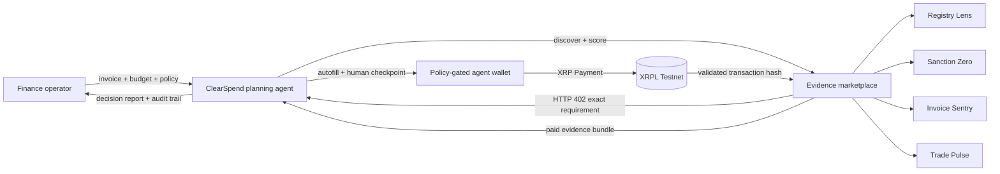

# ClearSpend

> The autonomous due-diligence buyer for small businesses — built by **Team Peaunts** for SingHacks 2026.

ClearSpend turns a supplier invoice and a spending policy into a decision-ready risk report. Its agent discovers specialist evidence providers, compares price, confidence, relevance, and speed, chooses the best bundle under budget, pays for it through an HTTP 402 flow, and delivers the purchased evidence only after the XRP Ledger receipt is validated.

## Team Peaunts

- Javerine
- Jing Wei
- Min Xie
- Shuan
- Evan Sim

## Why this should exist

Small businesses face the same supplier fraud, sanctions, and invoice-manipulation risks as large companies, but enterprise due-diligence suites are slow, expensive subscriptions. A finance operator should not need to know which registry, sanctions, reputation, or document-forensics API to buy.

ClearSpend makes those services composable and pay-per-use. The buyer sets an objective, risk posture, and hard XRP budget. The agent purchases only the evidence needed for that decision. Removing the agent brings back manual vendor research; removing autonomous micropayments brings back subscriptions and API account setup. Both are essential to the product.

## Commercial loop

1. A business submits a supplier invoice with a risk posture and spending cap.
2. The agent infers the required evidence categories and ranks a live provider market.
3. A merchant endpoint returns `402 Payment Required` with an exact XRPL payment requirement.
4. ClearSpend autofills the transaction and presents the full payment preview.
5. The user authorizes; the agent signs locally and waits for validated settlement.
6. The merchant verifies the ledger receipt, releases the evidence, and each selected provider earns per check.
7. ClearSpend can charge a routing fee or a monthly policy-management subscription.

## Architecture



## What is real in the prototype

- Multi-objective provider discovery and ranking with a hard, enforced spending cap.
- An x402-style merchant route at `GET /api/merchant/evidence/:reviewId`; without `X-PAYMENT` it returns HTTP 402 and an XRPL `exact` requirement.
- Two isolated, faucet-funded XRPL Testnet wallets whose seeds remain only in `.env`.
- `xrpl.js` transaction autofill, local signing, hash persistence before submission, `submitAndWait`, and merchant-side ledger verification.
- XRPL AI Starter Kit attribution with SourceTag `20260530`.
- An explicit human authorization checkpoint showing network, amount, fee, source, destination, sequence, expiry, source tag, and memo.
- Evidence delivery is gated on a validated `tesSUCCESS` transaction matching the expected payer, recipient, and exact amount.

The four evidence providers are deterministic prototype adapters so the demo is reproducible. Production adapters would call commercial company-registry, sanctions, document-forensics, and trade-data sources behind the same paid interface.

## Run locally

Requirements: Node.js 20+ and network access to XRPL Testnet.

```bash
npm install
npm run wallet:setup
npm run dev
```

Open [http://localhost:5173](http://localhost:5173). `wallet:setup` generates two wallets locally, immediately saves their seeds to the ignored `.env`, funds them from the Testnet faucet, and prints only their public addresses.

Validate the repository with `npm run check` and `npm run build`.

## API journey

```text
POST /api/reviews
  → agent plan, ranked providers, selected bundle, x402 requirement

POST /api/reviews/:id/prepare
  → live autofilled XRPL transaction preview (no signature)

POST /api/reviews/:id/authorize { "confirmed": true }
  → local signature → persisted hash → submitAndWait → ledger verification
  → purchased evidence and explorer receipt
```

Calling `GET /api/merchant/evidence/REVIEW_ID` without payment returns `402 Payment Required`. A validated transaction hash supplied as `X-PAYMENT` unlocks the evidence.

## Trust and safeguards

- Testnet is the default and is shown on every preview.
- Seeds are never returned by an API, logged, committed, or displayed in the UI.
- The transaction is autofilled before review; no guessed fees or sequence numbers.
- The signed hash is persisted before submission for crash reconciliation.
- `submitAndWait` prevents treating a queued transaction as settled.
- Exact amount, payer, recipient, result, and validation state are verified before delivery.
- Spending is limited twice: in bundle selection and in the exact payment requirement.
- The transaction memo contains only the internal review ID and is never treated as an instruction.
- Production design replaces local seeds with an HSM/KMS signer, provider attestations, rate limits, idempotency keys, and persistent storage.

## Transaction proof

Both authorized demo payments were validated with `tesSUCCESS` and reconciled without resubmission after fixing an XRPL API v2 receipt-field compatibility issue.

- [EA553E1E…04C2 — ledger 20477534](https://testnet.xrpl.org/transactions/EA553E1E42A2AC50E5983F125C8D73718C021C25226DFF731DD01FA9E68904C2)
- [CBF62BAC…B9F6 — ledger 20477601](https://testnet.xrpl.org/transactions/CBF62BAC26883E6A0F9C3C365EA2F36C0EC576AE9D1F8FA31B57AE8CCD42B9F6)

## Repository map

```text
src/                      React customer experience
server/planner.js         Agent policy, discovery, scoring, and evidence assembly
server/xrpl.js            Safe wallet, signing, submission, and verification layer
server/index.js           Review and x402 merchant API
scripts/setup-wallets.js  Testnet wallet creation and faucet funding
DEMO_SCRIPT.md            Three-minute judging walkthrough
BUILDER_FEEDBACK.md       Practical XRPL builder feedback
```
