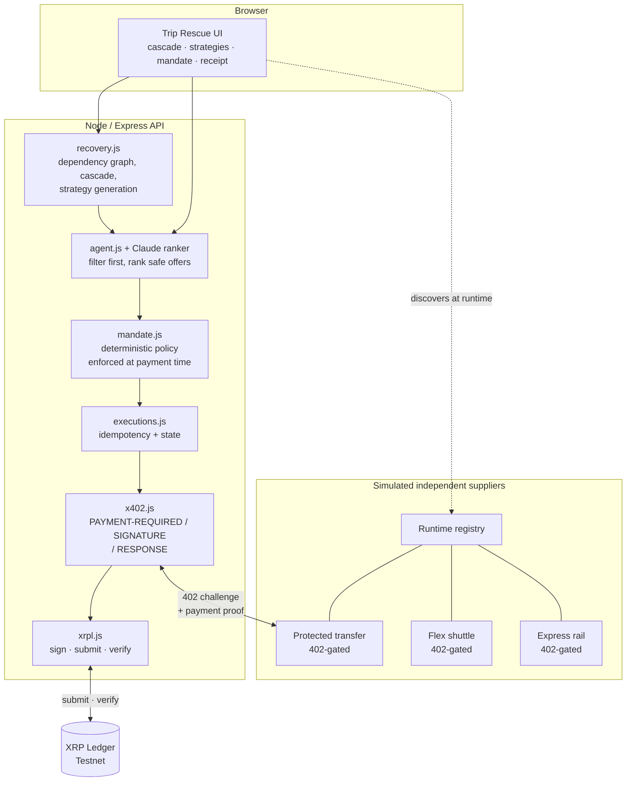
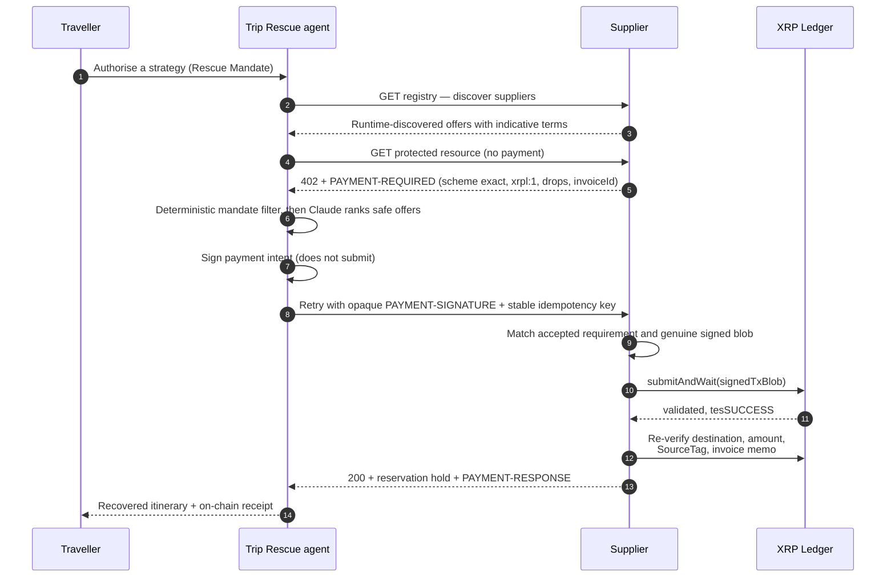

# Trip Rescue

> **When one booking breaks, fix the whole trip.**

Travel providers understand their booking. Trip Rescue understands your trip.

**Team Peaunts** — Javerine Tan · Min Xie
SingHacks 2026, Ripple Challenge: AI-native business on XRPL with x402.

---

## The problem

Independent travellers assemble one trip from many unrelated providers. Those
bookings are purchased independently but are **operationally dependent** on each
other:

```
flight arrival → airport bus → hotel check-in → rental pickup → next-day activity
```

When the flight is cancelled, the traveller becomes the integration layer. They
have to work out which downstream reservations are now impossible, which are
merely at risk, which cancellation deadlines are about to expire, and what must
be secured *before* anything is cancelled — while prices and availability keep
moving.

Each provider sees only its own booking. Nobody sees the trip.

**The real problem is not "find me another flight." It is "one booking broke, fix
the consequences across my whole trip."**

## What Trip Rescue does

Trip Rescue watches the traveller's trips. When a booking breaks, the alert
arrives — the traveller never triggers it. A cancelled outbound flight on a
seven-booking Tokyo itinerary:

| Booking | Provider | Status after cancellation |
| --- | --- | --- |
| Singapore → Narita flight | Demo Air | 🔴 broken — service cancelled |
| Narita → Hakone bus | Hakone Express | 🔴 broken — departs before the replacement lands |
| Hakone hotel | Hakone Springs | 🟠 at risk — no-show risk |
| Rental car pickup | Hakone Drive | 🟠 at risk — pickup before arrival |
| Mount Fuji activity | Fuji Day Tours | 🔴 broken — prerequisites unmet |
| Hakone → Narita transfer | Hakone Express | 🟢 safe — four days later |
| Narita → Singapore flight | Demo Air | 🟢 safe — the return home is untouched |

Showing where the damage **stops** matters as much as showing how far it
spreads. The same engine handles two other incidents, and the cascade genuinely
differs:

| Incident | Cascade |
| --- | --- |
| Outbound flight cancelled | 3 broken, 2 at risk, 2 safe |
| Rental car withdrawn | 2 broken, 5 safe — nothing upstream is touched |
| Day tour cancelled | 1 broken, 6 safe — contained |

**The traveller describes the trip in their own words.** "I have a client meeting
tomorrow and need to land before noon, I can spend up to $500 extra, and I
really don't want to lose the Fuji tour." That is genuine ambiguity, so it is
the one place an LLM is used — to *propose* a mandate, never to authorise one.

Every proposed field is validated against server-side truth before the traveller
sees it: a budget outside the permitted range is dropped rather than clamped, an
invented booking id is discarded, an unparseable deadline is refused. The same
optional Claude provider can rank only offers that deterministic policy already
approved; it cannot authorize payment or relax a constraint. If no API key is
configured or either model call fails, deterministic parsing and safest-compliant
offer selection take over, with the UI showing which method won. The traveller
confirms the proposal before it becomes a mandate.

```
"client meeting … before noon … up to $500"
        ↓  interpret (LLM, validated)
priority: business · budget: S$500 · arrive by: 5 Sep 12:00 JST
        ↓  traveller confirms
        Rescue Mandate
```

**Or they pick a priority directly.** That is the only
preference input, and it changes everything downstream:

| Priority | Budget | Recommended strategy | Agent buys | Why |
| --- | --- | --- | --- | --- |
| Leisure | S$300 | Most reliable | Protected transfer, S$48 | cheapest the mandate allows |
| Business | S$600 | Fastest | Express rail, **S$61** | arrives earliest |
| Family | S$450 | Most reliable | Protected transfer, S$48 | lowest risk |

Same cancellation, three different agent decisions, three different suppliers
paid. The priority sets the budget, the supplier allow-list and the ranking; it
can never relax a safety check.

The agent then:

1. Traverses the **trip dependency graph** and classifies every booking.
2. Generates **three whole-trip recovery strategies** — Fastest, Cheapest, Most
   Reliable — each with its actions, cost, arrival time, risk and irreversible
   steps.
3. The traveller **authorises one strategy**. That becomes a bounded **Rescue
   Mandate**.
4. Inside the mandate the agent **discovers suppliers at runtime**, is challenged
   with **HTTP 402**, decides whether the resource is worth buying, **settles on
   the XRP Ledger**, and receives the protected resource only after the supplier
   verifies the payment on-ledger.

The traveller makes one strategic decision. The agent does the operational and
economic work inside explicit limits.

## Architecture



### The commercial loop



**The agent signs the payment but does not submit it.** The supplier submits,
waits for validation, and independently re-verifies the transaction against the
ledger before releasing anything. Delivery before settlement is therefore
*structurally impossible*, not merely checked.

## Why x402 and XRPL, and not a card

The honest version: a card can buy a hotel room. What a card cannot do is let an
agent transact with a service it has **no account with, no API key for, and no
prior relationship to**.

Trip Rescue's agent is not pre-provisioned with any supplier. It reads a
registry at runtime, meets services it has never seen, learns their price from
their own `402` response, decides whether each is worth buying against a budget,
and pays — in one round trip, with no onboarding, no checkout flow and no human
re-entering card details for each provider.

That is the capability x402 adds, and XRPL is what makes it economical: sub-cent
fees and validated settlement in seconds, with escrow and payments as native
protocol primitives.

### x402 implementation

Wire format follows the [XRPL x402 specification](https://xrpl-x402.t54.ai/docs/xrpl-scheme):

| Direction | Header | Contents |
| --- | --- | --- |
| Supplier → agent | `PAYMENT-REQUIRED` | base64 JSON challenge |
| Agent → supplier | `PAYMENT-SIGNATURE` | base64 JSON signed payload |
| Supplier → agent | `PAYMENT-RESPONSE` | base64 JSON settlement result |

Challenge entries use `scheme: "exact"`, CAIP-2 `network: "xrpl:1"` (Testnet),
`asset: "XRP"`, `payTo`, `amount` in drops, `maxTimeoutSeconds`, and
`extra.invoiceId` / `extra.sourceTag`. Full detail in
[docs/API_CONTRACT.md](./docs/API_CONTRACT.md).

The `invoiceId` binds one payment to exactly one recovery and one offer, so a
receipt for a different offer can never unlock a resource.

### XRPL integration

Payments carry SourceTag `20260530` for AI Starter Kit attribution and a
`triprescue/x402` memo holding the invoice id. `server/xrpl.js` handles signing,
submission and independent on-ledger verification.

## Safeguards

Release-blocking invariants, each covered by tests:

| # | Invariant | Where |
| --- | --- | --- |
| 1 | The agent cannot exceed the Rescue Mandate | `mandate.js`, re-checked at prepare **and** execute |
| 2 | The supplier cannot deliver before verifying settlement | supplier submits, then re-reads the ledger |
| 3 | Repeating an execution cannot create a duplicate purchase | `executions.js` idempotency fingerprints |
| 4 | Failed, expired or mismatched payments cannot unlock delivery | `verifySettlement` checks 8 properties |
| 5 | Destination, amount, network, supplier and invoice must match | server state wins over client input |
| 6 | Wallet seeds stay server-side | never returned by any route; `.env` gitignored |
| 7 | Every economic decision has an inspectable reason | decision trace in the UI |

Budget is reserved *before* submission, so concurrent requests cannot
 double-spend the mandate. A known pre-submission failure releases the
reservation; if the ledger may already have accepted the transaction but
verification is uncertain, the reservation remains held and delivery is
blocked rather than risking a second payment.

## Failure handling, demonstrated

Safeguards that cannot be broken on demand are just assertions. The UI has a
fault injector, so the failure paths can be shown live:

| Injected fault | What happens | Budget |
| --- | --- | --- |
| Supplier offline | `503` at the challenge, before any payment is attempted | untouched |
| Settlement rejected | `502`, execution marked failed, nothing delivered | **released** |
| Budget exhausted | `403 mandate-violation` at prepare, agent halts | no payment |

A simulated failure before submission releases the reservation. A failure after
submission but before independent verification retains the reservation and
blocks delivery until reconciliation. The same modes are available over the API:

```bash
curl -X POST localhost:8787/api/demo/fault -H 'content-type: application/json'   -d '{"mode":"settlement-fail"}'
```

## XRPL Testnet transactions

All validated on Testnet, `tesSUCCESS`, SourceTag `20260530`. The amount follows
the supplier the agent chose, so the business-priority run settles a different
sum to a different payee:

| Ledger | Transaction |
| --- | --- |
| 20482189 | [`6BA53E5B…31D5`](https://testnet.xrpl.org/transactions/6BA53E5B56A41CECFA1D1960821079669C2AB7CC5ED4AB1E53157677F3B331D5) |
| 20482307 | [`7D2A9565…0A53`](https://testnet.xrpl.org/transactions/7D2A95654DE41ACBE249BAB9EAF8EE09BD30D76F4AEB126BE5F6FC28416E0A53) |
| 20482546 | [`F91CE25D…3971`](https://testnet.xrpl.org/transactions/F91CE25D2B4144935D00D1B3B554C1FA4861AA6A4054242217ABA234A1B33971) |
| 20483474 | [`D399B05B…5D88`](https://testnet.xrpl.org/transactions/D399B05B1F13C5F3555B28822566B72D92F5A24672B4F65B68F90ACEFD275D88) — business priority, **61000 drops** to a different supplier |

Agent wallet `rMmDQfbKv6GTr7KZZ4cSWKV9r5sv1Kyksm` → supplier wallet
`rnkMaVghfEbsgWx8GXidh5c1PJ4V9Mvn2y`.

## Setup

Requires Node 18+.

```bash
npm install
cp .env.example .env
npm run wallet:setup
npm run dev
```

`wallet:setup` creates and funds two XRPL Testnet wallets and writes their seeds
to `.env`. Then open <http://localhost:5173>.

| Command | What it does |
| --- | --- |
| `npm run dev` | API on :8787, web on :5173 |
| `npm run check` | Typecheck and unit tests |
| `npm run build` | Production build |
| `npm run demo:x402` | Walks the whole commercial loop in the terminal |
| `curl -X POST localhost:8787/api/demo/reset` | Restore the mandate budget between runs |

> `.env` holds XRPL Testnet seeds and is gitignored. Never commit it, and never
> put Mainnet keys in it.

## Repo layout

```
server/recovery.js     trip graph, cascade analysis, strategy generation
server/interpret.js    free text to a validated mandate proposal (the only LLM)
server/mandate.js      deterministic mandate enforcement
server/x402.js         x402 wire format, the one translation point
server/xrpl.js         sign, submit, verify on XRPL Testnet
server/suppliers.js    simulated suppliers + runtime registry
server/executions.js   idempotency and execution state
server/routes.js       recovery, supplier, 402 and payment routes
src/                   React UI — cascade, strategies, mandate, receipt
docs/TripRescue-pitch.pptx  16:9 pitch deck (regenerate: node docs/build-pitch-deck.js)
docs/BUILD_PLAN.md     scope, gates, safety invariants
docs/API_CONTRACT.md   integration contract between both halves
BUILDER_FEEDBACK.md    XRPL developer feedback from this build
```

## Scope: what is real and what is simulated

Being precise about this, because it matters for judging.

**Real.** The XRPL Testnet settlement, signing and verification. The HTTP 402
challenge, payment proof and gated delivery. Mandate enforcement, idempotency
and failure handling. The cascade and strategy logic, which is deterministic and
tested.

**Simulated.** The travel suppliers. No airline, hotel or coach operator exposes
an x402 machine-purchasing interface today, so the three suppliers are our own
services implementing the real protocol. They are deliberately reached only
through a runtime registry, so the agent discovers them rather than being wired
to them — but they are not real inventory, and the reservation hold is not a real
booking.

**Out of scope for V1.** Real supplier integration, email itinerary ingestion,
disruption types beyond flight cancellation, initial trip planning, and Mainnet.

## Builder feedback

XRPL developer feedback gathered during this build is in
[BUILDER_FEEDBACK.md](./BUILDER_FEEDBACK.md), and was also submitted
continuously through the hackathon feedback hook.

The hook is installed project-scoped in `.claude/settings.json` and
`.codex/hooks.json`. Each teammate runs this once after cloning:

```bash
TEAM_NAME="Peaunts" HACKER_NAME="<your name>" node hook/setup.mjs --non-interactive
```
